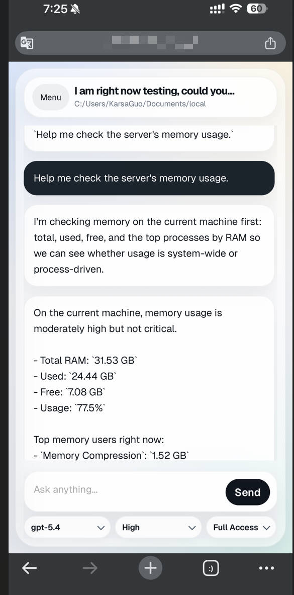
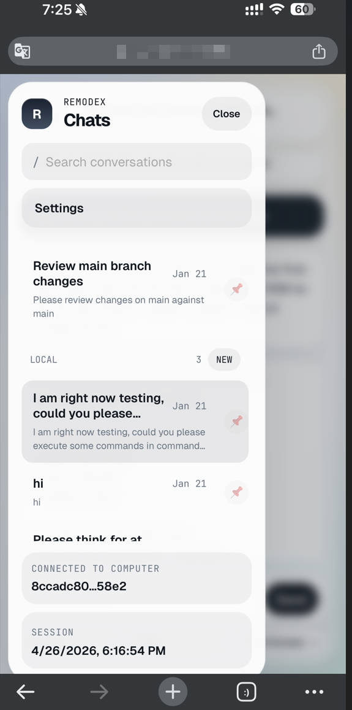
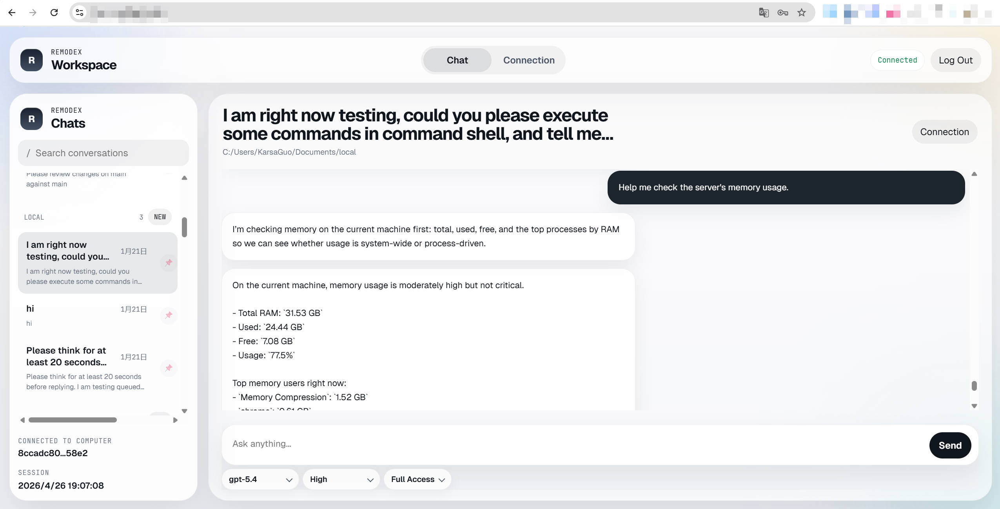

# RemodexOnAnyDevices

[English](README.md) | [中文](README-zh.md)

RemodexOnAnyDevice 让你可以一边在外健身一边vibe coding，或者在你的windows上也可以用codex-app来操作你远程linux服务器的项目（官方 Codex app 目前并不直接支持让你在你的windows机器上用codex跑你一个在服务器上的project）。

此外，原版只支持iPhone使用，RemodexOnAnyDevices让你可以在任何手机使用，且原版对Windows/Linux部署的兼容性较差，RemodexOnAnyDevices在这方面专门做了一些优化。

上游项目的 ISC License 保留在 [LICENSE](LICENSE) 中。

## Demo

<div align="center">
  
  
  
</div>

## 与 remodex 的区别

- 自动pairing，使用密码登录（不需要通过二维码配对）
- 本地 bridge 会话
- 更好地支持 Windows 和 Linux 部署（比如一些重连机制）

## 详细说明

- `phodex-bridge/`：与 Codex 通信的本地 Node.js bridge
- `web-client/`：用于配对、线程浏览和聊天的本地 Web UI
- `relay/`：供本地 / 自托管部署使用的 relay 服务

## 快速开始

### Bridge

```sh
cd phodex-bridge
npm install
npm start
```

### Web Client

```sh
cd web-client
npm install
npm run set-password -- --generate --write-plaintext
npm start
```

然后打开 `http://127.0.0.1:8787`。

## 管理员密码

Web UI 使用本地管理员密码登录。

- 推荐命令：`npm run set-password -- --generate --write-plaintext`
- 这会生成一个高强度密码，把哈希写入 `web-client/state/auth-state.json`，并把明文密码写入 `web-client/state/admin-password.txt`
- 你也可以手动指定密码：`npm run set-password -- --password "<strong password>"`
- 如果你更喜欢通过环境变量传入，也可以使用 `REMODEX_WEB_ADMIN_PASSWORD`

## 部署方式

你不一定要把所有东西都直接暴露到公网。当前比较实际的部署方式有下面几种：

### 1. 局域网 / 同网络部署

使用内置的本地 relay 启动脚本，并把手机能够访问到的主机名或 IP 广播出去：

```sh
./run-local-remodex.sh --hostname <局域网可访问的 IP 或主机名> --port 9000
```

然后本地启动 web client，再用刚才生成的管理员密码登录。

如果你的手机和运行 Codex 的机器处在同一个局域网或 Wi-Fi，这通常是最简单的方式。

### 2. Windows 或本地桌面 + 公网 Linux relay

- 在有公网 IP 或公网域名的 Linux 机器上运行 `relay/`
- 在真正运行 Codex 的 Windows、macOS 或 Linux 机器上运行 `phodex-bridge/`
- 通过 `REMODEX_RELAY` 让 bridge 指向这个公网 relay
- 在你希望提供浏览器界面的地方运行 `web-client/`，比如在你的公网服务器上
- 此方案建议用wss以免数据泄露。其他方案下，会有上层协议/本来就处于私网，所以可以保证数据安全，用ws也无所谓

bridge 启动示例：

```sh
cd phodex-bridge
npm install
REMODEX_RELAY=wss://your-linux-host.example.com/relay npm start
```

relay 启动示例：

```sh
cd relay
npm install
npm start
```

这种模式下，Codex 和你的仓库仍然只留在你自己的机器上。Linux 服务器只承担 relay 传输层角色。

### 3. 用 Tailscale 做私网访问，而不是直接上公网

如果你不想开公网端口，Tailscale 通常是最干净的方案(无公网IP下，就可以用这个协议来让两个设备通信，是比较安全的私网协议)

典型做法：

1. 在运行 relay 的机器，或者运行一体化本地启动器的机器上安装 Tailscale
2. 在手机上安装 Tailscale，并登录到同一个 tailnet
3. 使用这台机器的 Tailscale IP 或 MagicDNS 名称作为 relay 主机名
4. 用这个 Tailscale 可达地址启动 relay / bridge

例如：

```sh
./run-local-remodex.sh --hostname <你的 tailnet 主机名或 Tailscale IP> --port 9000
```

如果 relay 是单独部署的：

```sh
cd phodex-bridge
REMODEX_RELAY=ws://<relay-tailnet-name-or-tailscale-ip>:9000/relay npm start
```

如果你还想让 web UI 也只在 tailnet 内可访问，那么正常启动 web client 后，在该机器上通过 Tailscale Serve 暴露 `8787` 即可。较新的 Tailscale 版本可使用：

```sh
tailscale serve localhost:8787
```

这样 Web UI 只会对 tailnet 内设备开放。如果你需要公网 URL，那是 Tailscale Funnel 的场景，和上面这种仅 tailnet 内访问不是一回事。

## Web Client 说明

Web Client 用于在你自己的 bridge 运行时进行本地管理和聊天访问：

- 它会从本地文件读取配对 JSON
- 它会将认证 / 安全状态保存在 `web-client/state/` 下
- 它不依赖任何托管后端
- 它现在包含一个面向移动端的聊天布局，而不是仅仅把桌面布局硬压缩到小屏幕上

详情见 [web-client/README.md](web-client/README.md)。
